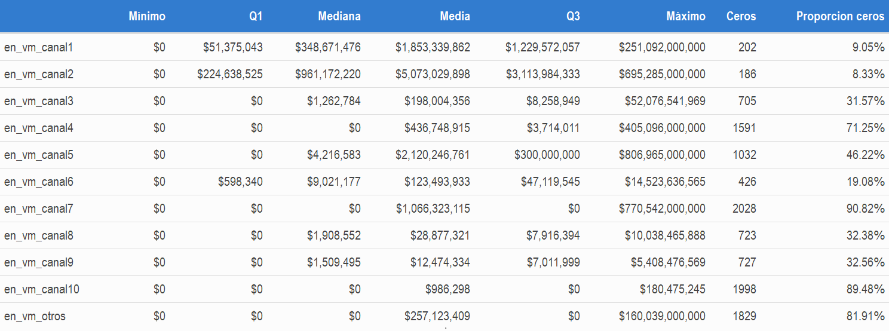
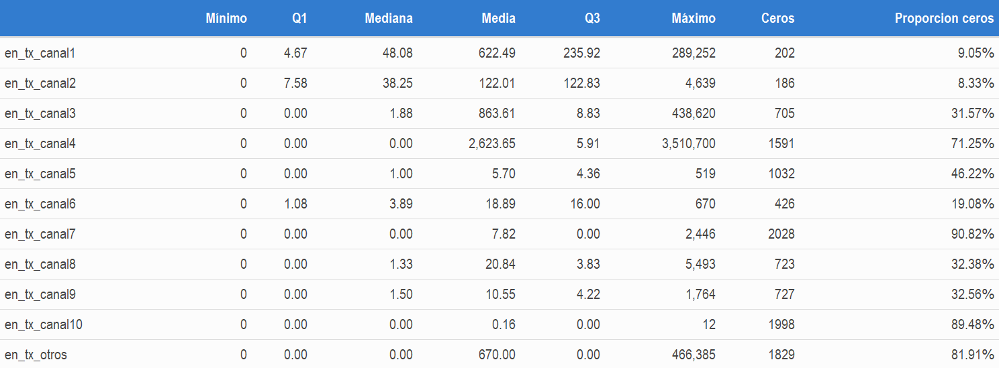
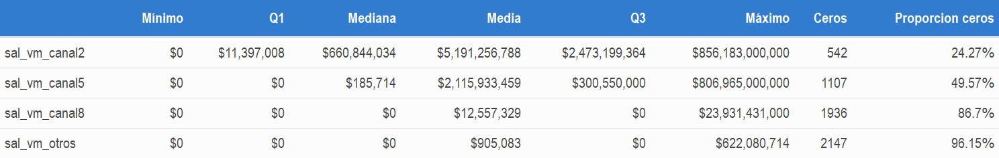
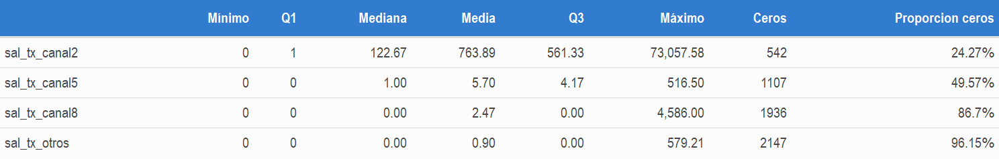

<br>

<center>
<h1>Introducción</h1>
</center>

<div style='text-align: justify;'> 
En la actualidad es vital para toda empresa u organización conocer a fondo las necesidades, deseos y preferencias de sus clientes, con el objetivo de generar nuevas oportunidades en torno al desarrollo y optimización de productos y servicios, la creación de canales de comunicación y estrategias de publicidad orientadas a un publico claramente definido, y en general, el establecimiento de un modelo de negocio personalizado para cada grupo de clientes, permitiendo la fidelización de aquellos que se encuentran asociados a la organización y la atracción de potenciales consumidores. Motivados por lo anterior y atendiendo a la solicitud de una empresa anónima, este documento presenta una propuesta de segmentación de clientes que permitirá identificar los principales patrones de uso de productos y la relación de estos con los estados financieros.
</div>

---

<br>
<br>

<center>
<h1>Contexto</h1>
</center>

<div style='text-align: justify;'>
Una compañía del sector financiero requiere una segmentación de clientes (quienes tienen la cualidad de ser otras empresas), con el objetivo de obtener grupos con características comunes que permitan identificar patrones de uso de los diferentes canales y productos y la relación de estos con los estados financieros de cada cliente, sin embargo, por privacidad el solicitante ha decidido no aportar información acerca del contexto empresarial de la organización, brindándonos tan solo la base de datos requerida para construir la propuesta. La descripción de las variables allí contenidas se presenta a continuación:
</div>

**Variables de comportamiento de los clientes en canales y productos**
<div style='text-align: justify;'>    
Dentro de esta categoría se encuentran cuatro subgrupos de variables que determinan cómo interactúan los clientes con cada uno de los canales de la empresa. Dado que no se conoce el contexto o tipo de organización con la que estamos trabajando, suponemos que cada canal representa un medio por el cual se pueden realizar transacciones monetarias, como lo pueden ser pago en efectivo, giro bancario, transferencia bancaria, cheque, pagaré, etc.
</div>    
    
1. El subgrupo de **variables en_vm_canalX** representa el valor del ticket promedio anual de entrada a través del canal **X**.

\newline

2. El subgrupo de **variables en_tx_canalX** representa la cantidad de transacciones de entrada promedio mensuales a través del canal **X**.
    
\newline

3. El subgrupo de **variables sal_vm_canalX** representa el valor del ticket promedio anual de salida a través del canal **X**.
    
\newline    
    
4. El subgrupo de **variables sal_vm_canalX** representa la cantidad de transacciones de salida promedio mensuales a través **X**.

<div style='text-align: justify;'>
A continuación se presentan las tablas que indican las variables pertenecientes a cada subgrupo mencionado anteriormente.
</div>


|variables en_vm_canalX|variables en_tx_canalX|    
|--------------|-----------|    
|en_vm_canal1 |en_tx_canal1 |
|en_vm_canal2 |en_tx_canal2 |
|en_vm_canal3 |en_tx_canal3 |
|en_vm_canal4 |en_tx_canal4 |
|en_vm_canal5 |en_tx_canal5 |
|en_vm_canal6 |en_tx_canal6 |
|en_vm_canal7 |en_tx_canal7 |
|en_vm_canal8 |en_tx_canal8 |
|en_vm_canal9 |en_tx_canal9 |
|en_vm_canal10|en_tx_canal10|
|en_vm_otros  |en_tx_otros  |

|variables sal_vm_canalX|variables sal_tx_canalX|    
|--------------|-----------| 
|sal_vm_canal2 |sal_tx_canal2 |
|sal_vm_canal5 |sal_tx_canal5 |
|sal_vm_canal8 |sal_tx_canal8 |
|sal_vm_otros  |sal_tx_otros  |

**Variables de estados financieros y características de los clientes**
<div style='text-align: justify;'>
Dentro de esta categoría se encuentran las caracteristicas propias de cada cliente reflejadas a través de sus estados financieros. Las variables asociadas y su descripción se encuentran en la siguiente tabla:
</div>

<table>
<col width="250">
  <tr>
    <th>Variable</th>
    <th>Descripción</th>
  </tr>
  <tr>
    <td>`impo_cv`</td>
    <td style='text-align: justify;'>$\frac {Importaciones}{Compras}$ indica la proporción de compras que son importadas.
    <br>
    Variable categorizada ordinalmente en cinco niveles.</td>
  </tr>
  <tr>
    <td>`expo_vt`</td>
    <td style='text-align: justify;'>$\frac {Exportaciones}{Ventas}$ indica la proporción de ventas que son exportadas.
    <br></br>
    Variable categorizada ordinalmente en tres niveles.</td>
  </tr>
  <tr>
    <td>`cxp`</td>
    <td style='text-align: justify;'> Cuentas por pagar, indica las deudas que tiene la empresa debido a la adquisición de bienes y servicios.
    <br></br>
    Variable categorizada ordinalmente en seis niveles.</td>
  </tr>
  <tr>
    <td>`cxc`</td>
    <td style='text-align: justify;'> Cuentas por cobrar, indica los derechos de cobro que tiene la empresa sobre algún tercero debido a la venta de productos o la prestación previa de servicios.
    <br></br>
    Variable categorizada ordinalmente en seis niveles.</td>
  </tr>
  <tr>
    <td>`totalinventory`</td>
    <td style='text-align: justify;'> Valor de inventarios.
    <br></br>
    Variable categorizada ordinalmente en seis niveles.</td>
  </tr>
  <tr>
    <td>`pagos_pj`</td>
    <td style='text-align: justify;'> $\frac {Pagos Hechos A Personas Juridicas}{Pagos Totales}$ refleja la proporción de pagos que ha realizado la empresa a personas jurídicas.
  </tr>
  <tr>
    <td>`pagos_pn`</td>
    <td style='text-align: justify;'> $\frac {Pagos Hechos A Personas Naturales}{Pagos Totales}$ refleja la proporción de pagos que ha realizado la empresa a personas naturales.
  </tr>
  <tr>
    <td>`tiene_ventas_fisicas`</td>
    <td style='text-align: justify;'> Variable binaria que indica si la empresa tiene puntos de venta físicos.
    <br>1: Si
    <br>0: No
  </tr>
  <tr>
    <td>`tiene_ventas_electronicas`</td>
    <td style='text-align: justify;'> Variable binaria que indica si la empresa tiene venta electronicas.
    <br>1: Si
    <br>0: No
  </tr>
  <tr>
    <td>`recaudos_pj`</td>
    <td style='text-align: justify;'> $\frac {Recaudos Provenientes De Personas Juridicas}{Recaudos Totales}$ refleja la proporción de recaudos que ha realizado la empresa a personas jurídicas.
  </tr>
  <tr>
    <td>`pagos_pn`</td>
    <td style='text-align: justify;'> $\frac {Recaudos Provenientes De Personas Naturales}{Recaudos Totales}$ refleja la proporción de recaudos que ha realizado la empresa a personas naturales.
  </tr>
  <tr>
    <td>`rotacion_inventarios`</td>
    <td style='text-align: justify;'> Indica la rotación de inventario en días.
    <br> Variable categorizada en seis niveles.
    </td>
  </tr>
  <tr>
    <td>`rotacion_cxc`</td>
    <td style='text-align: justify;'>  Indica la rotación de cuentas por cobrar en días.
    <br> Variable categorizada en seis niveles.
    </td>
  </tr>
  <tr>
    <td>`rotacion_cxp`</td>
    <td style='text-align: justify;'> Indica la rotación de cuentas por pagar en días.
    <br> Variable categorizada en seis niveles.
    </td>
  </tr>
  <tr>
    <td>`ciclo_negocio`</td>
    <td style='text-align: justify;'>  Indica la duración del ciclo de negocio en días.
    <br> Variable categorizada en seis niveles.
    </td>
  </tr>
  <tr>
    <td>`ciclo_financiero`</td>
    <td style='text-align: justify;'>  Indica la rotación del ciclo financiero en días.
    <br> Variable categorizada en seis niveles.
    </td>
  </tr>
</table>

---

<br>
<br>

<center>
<h1>Análisis exploratorio</h1>
</center>

<div style='text-align: justify;'> 
Con el objetivo de crear una idea clara del comportamiento de las variables y descubrir como los clientes interactúan con cada una de ellas, iniciamos realizando un análisis exploratorio haciendo uso de la descripción proporcionada anteriormente.
</div>

<div style='text-align: justify;'> 
Dado que el conjunto de datos cuenta con 46 caracteristicas a describir, este documento presenta para las variables de comportamiento en canales y productos un resumen de cada subgrupo y el correspondiente enlace en el cual se podrá consultar el análisis detallado que contiene todas las funciones y el código necesario para ser reproducido de forma independiente. En lo que respecta a las variables pertenecientes a la categoría de estados financieros y características de los clientes, solo se incluye el enlace donde se podrá consultar todo el análisis detallado, esto ultimo dado que al ser datos categóricos ordinales con niveles diferentes y algunos continuos, vale la pena entender cada aspecto a detalle.
</div>


## 1. Comportamiento de los clientes en canales y productos

<div style='text-align: justify;'> 
Este grupo de variables registran el valor y la cantidad de transacciones, tanto de entrada como de salida en un determinado periodo de tiempo, permitiéndonos entender cómo los clientes interactúan con cada uno de los canales de la organización y obtener conocimiento a partir de ello, aportándonos con esto una primera impresión de posibles patrones o tendencias de uso.
</div>

### 1.1. Variables de tipo `en_vm_canalX`

<div style='text-align: justify;'>
Como se mencionó previamente, este subgrupo de variables registran el valor del ticket promedio de entrada a través de un canal determinado, para facilitar su comprensión estos se asocian con medios a través de los cuales se pueden realizar pagos por la adquisición de productos o servicios. Su codificación sigue el siguiente esquema:

* **en:** Entrada
* **vm:** Valor medio anual
* **X:** Número identificador del canal

A continuación se presentan las conclusiones generales de lo evidenciado en el **[análisis exploratorio de variables en_vm_canalX](https://mateoe.github.io/segmentacionClientes/analisis/analisis_exploratorio_en_vm.html)**, haciendo uso de la tabla que reúne todos los resultados de los resúmenes numéricos.
</div>



<div style='text-align: justify;'>
1. Algunos canales son frecuentemente más usados por los clientes, esto se observa principalmente en los dos primeros que no superan el 10% de sus entradas en cero y el sexto que no supera el 20%, los demás presentan una proporción de ceros superior al 30%.

2. Los canales 7, 10 y "otros" tienen la gran mayoría de entradas en cero, indicando que pueden ser de difícil acceso, restrictivos o exclusivos para un público determinado.

3. Observando la media se destaca que a través de los canales 1, 2, 5 y 7 se realizan transacciones de mayor valor.

4. El canal 7 a pesar de tener la mayor proporción de entradas en cero (90.82%), posee el segundo máximo más alto de todos, indicando que se puede tratar de un medio exclusivo o con facilidades para realizar transacciones de grandes valores monetarios. Algo similar sucede con el canal 4, pero en una magnitud menor.

5. El canal 10 además de poseer la segunda proporción de entradas en cero (89.48%) más alta, es el que presenta los valores más bajos, por lo cual se intuye que se puede tratar de un medio restrictivo, de difícil acceso o limitante.

6. De los puntos 1 y 3 se resalta que el canal 2 además de ser típicamente usado también presenta valores máximos muy altos, dando la impresión de ser flexible, de fácil acceso y poco restrictivo. Para el canal 1 se puede concluir de forma similar, pero en una magnitud monetaria menor.

7. Los canales 3, 8 y 9 tienen una apariencia bastante promedio, con una proporción de ceros no superior al 33% y con valores monetarios moderadamente bajos.

8. Como se observó del punto 1, el canal 6 presenta un uso bastante alto, sin embargo, como se puede notar en la tabla, sus valores monetarios son relativamente bajos, indicando que es de fácil acceso y uso para transacciones de magnitudes económicas moderadamente bajas.

9. A pesar de que "otros" presenta la tercera proporción de ceros más alta, las magnitudes económicas que maneja son moderadamente altas.
</div>


### 1.2. Variables de tipo `en_tx_canalX`

<div style='text-align: justify;'>
Este subgrupo de variables registran la cantidad de transacciones mensuales promedio de entrada a través de un canal determinado. Su codificación sigue el siguiente esquema:

* **en:** Entrada
* **tx:** Transacciones mensuales promedio
* **X:** Número identificador del canal

A continuación se presentan las conclusiones generales de lo evidenciado en el **[análisis exploratorio de variables en_tx_canalX](https://mateoe.github.io/segmentacionClientes/analisis/analisis_exploratorio_en_tx.html)**, haciendo uso de la tabla que reúne todos los resultados de los resumenes numéricos.
</div>



<div style='text-align: justify;'>
1. El canal 4 a pesar de poseer una proporción de ceros del 71.25%, maneja un máximo de transacciones significativamente más alto que el de los demás, superando los tres millones y medio, lo cual afecta en gran medida el valor de la media.

2. Los canales 1 y 2 al poseer una baja proporción de ceros (no superior al 10%) y manejar un número moderadamente alto de transacciones, dan la apariencia de ser fácilmente accesibles, flexibles y comúnmente más usados que los demás.

3. El canal 10 se destaca no solo por poseer la segunda proporción de entradas en cero más alta (89.48%) , además posee un valor máximo extremadamente bajo, reflejando que es poco usado, con lo cual se intuye que es restrictivo, de difícil acceso o limitante.

4. El canal 3 es en promedio el segundo a través del cual se realiza un número mayor de transacciones de entrada, además al poseer una proporción de entradas en cero no mayor al 32%, da la impresión de tener una accesibilidad moderadamente alta.

5. A pesar de que "otros" tiene la tercera mayor proporción de entradas en cero (81.91%), posee el segundo máximo mas alto en el número de transacciones, y una media considerablemente alta.

6. El canal 5 aparentemente es un canal de uso medio en cuanto al número de transacciones de entrada, no solo por manejar una proporción de entradas en cero cercana al 50% sino también porque la cantidad de transacciones para cada medida de resumen es moderadamente baja.

7. El canal 6 al tener una proporción de entradas en cero cercana al 20% y un número moderado de transacciones en cada una de sus medidas de resumen, da la apariencia de ser típicamente usado y de fácil acceso, con un comportamiento similar a los dos primeros canales pero en una magnitud menor.

8. El canal 7 posee la porporción más elevada de entradas en cero (90.82%), lo cual afecta significativamente el valor de la media, sin embargo los valores máximos son bastante promedio en comparación con el resto de las variables, reflejando que se puede tratar de un canal exclusivo o dedicado a clientes específicos.

9. Los canales 8 y 9 tienen un aspecto bastante promedio en comparación con los demás, con una proporción de ceros es cercana al 33% y un número moderado de transacciones.
</div>


### 1.3. Variables de tipo `sal_vm_canalX` y `sal_tx_canalX`

<div style='text-align: justify;'>
Estos dos subgrupos de variables registran el valor del ticket promedio y la cantidad de transacciones mensuales promedio de salida a través de un canal determinado, para facilitar su comprensión se asocia una transacción de salida como una transferencia monetaria por motivo de devolución. 

A continuación se presentan las conclusiones generales de lo evidenciado en el **[análisis exploratorio de variables sal_vm_canalX y sal_tx_canalX](https://mateoe.github.io/segmentacionClientes/analisis/analisis_exploratorio_sal_vm_sal_tx.html)**.
</div>


**Conclusiones: `sal_vm_canalX`**



<div style='text-align: justify;'>
Como se puede observar en la tabla, existe una clara tendencia en el uso y valor transaccional para cada canal, donde:

* El canal 2 maneja los valores monetarios más altos y posee la menor proporción de ceros (24.27%), reflejando que es comunmente usado.
* El canal 5 posee el doble de entradas en cero y valores menores que el anterior en cada medida del resumen numérico, reflejando que es de uso medio y más limitado.
* El canal 8 por su parte maneja una alta cantidad de entradas en cero, con valores significativamente menores en cada una de las medidas, dando la impresión de ser más restrictivo y poco usado para transacciones de salida.
* "Otros" posee más del 96% de sus entradas en cero, dando la idea de ser un canal raramente usado para este tipo de operaciones, el cual maneja montos significativamente pequeños en comparación con los demás.
</div>


**Conclusiones: `sal_tx_canalX`**



<div style='text-align: justify;'>
Los resultados de este análisis presentan una tendencia similar a lo evidenciado para las variables de tipo `sal_vm_canalX` con un comportamiento en cuanto al uso similar para ambos, dado que poseen la misma proporción de entradas en cero, sin embargo se destaca que:

* El canal 2 es transaccionalmente más activo que los demás, presentando valores demasiado altos en todas las medidas de resumen.
* Si bien en promedio el canal 5 presenta un mayor número de transacciones, el canal 8 muestra valores máximos significativamente más altos.
* Similar a lo expresado anteriormente, "otros" a pesar de ser raramente usado para transacciones de salida tiene un valor máximo levemente mayor al observado en el canal 5.
</div>


## 2. Estados financieros y características 

<div style='text-align: justify;'> 
Este grupo de variables presenta las características propias de cada empresa (cliente) a través de sus estados financieros, las cuales se analizarán con el objetivo de comprender a fondo los posibles rasgos y propiedades comunes que aporten una idea detallada de qué tipo de clientes se encuentran asociados a la organización.

Dado que en los estados financieros y características se cuenta con dos tipos de variables, uno categorizado ordinalmente y otro continuo, en este caso no se realiza una metodología de resumen como lo observado para los canales y productos, en su lugar se proporciona el enlace al documento detallado donde se aportan todas las gráficas, tablas, interpretaciones de niveles y análisis que permiten comprender a profundidad las particularidades de los clientes.

Todo lo mencionado previamente se encuentra disponible en el siguiente enlace: **[análisis exploratorio - estados financieros y características](https://mateoe.github.io/segmentacionClientes/analisis/analisis_exploratorio_estados_caracteristicas.html)**.
</div>

---

<br>
<br>

<center>
<h1>Segmentación</h1>
</center>

<div style='text-align: justify;'>
Antes de iniciar este proceso es importante recordar que nuestro conjunto de datos cuenta con variables mixtas, es decir, algunas características son continuas y otras categóricas ordinales, lo cual se puede apreciar tanto en el contexto como en el análisis exploratorio. Lo anterior indica que no es adecuado utilizar métricas, medidas de distancia y/o algoritmos que requieran que los datos sean continuos (como puede ser el caso de K-means), debido a ello a continuación se describe resumidamente la medida de distancia y el algoritmo a utilizar:
</div>

**Medida de distancia**
<div style='text-align: justify;'>
La _distancia de Gower_ es una medida de disimilitud que indica el grado de diferencia entre dos observaciones, estableciendo un valor entre $0$ y $1$, donde $(0)$ indica que ambas son iguales y $(1)$ indica que son completamente diferentes, esta combina diferentes métricas para variables cuantitativas, nominales y ordinales, por lo que es popularmente usada para datos mixtos.

En el siguiente articulo se define y describe detalladamente el funcionamiento de la medida de disimilitud mencionada previamente: _<a href = "https://medium.com/analytics-vidhya/gowers-distance-899f9c4bd553" target = "_blank">distancia de Gower</a>_. 
</div>

**Algoritmo**
<div style='text-align: justify;'>
El algoritmo pam (Partición alrededor de medoides) según la _<a href = "https://www.rdocumentation.org/packages/cluster/versions/2.1.2/topics/pam" target = "_blank">documentación oficial</a>_ es una versión más robusta del algoritmo *K-means*, la cual se basa en encontrar los medoides que permitan dividir el conjunto de datos en $K$ grupos previamente definidos, donde un medoide se refiere a un objeto que posee la mínima disimilitud promedio entre él y todas las demás observaciones al interior del grupo. Este algoritmo tiene la ventaja de aceptar matrices de disimilitud como la proporcionada por la _distancia de Gower_.

El siguiente articulo define y describe detalladamente su funcionamiento: _<a href = "https://www.datanovia.com/en/lessons/k-medoids-in-r-algorithm-and-practical-examples/" target = "_blank">pam</a>_.
</div>

## Proceso de segmentación
<div style='text-align: justify;'>
Con la intención de evitar sobrecargar el informe principal con todo el proceso para la obtención de grupos, dicho procedimiento se realizó en el documento denominado **[proceso de segmentación](https://mateoe.github.io/segmentacionClientes/proceso_segmentacion.html)**, en el cual se llevaron a cabo las siguientes actividades a detalle:

1. Pasos previos a la segmentación.
2. Refactorización y creación de nuevas variables.
3. Segmentación.
</div>

---

<br>
<br>

<center>
<h1>Análisis de resultados</h1>
</center>

<div style='text-align: justify;'>
Tras completar el proceso anterior se obtiene una base de datos segmentada donde las observaciones se asocian a un conjunto con características comunes, sin embargo, aún son desconocidas las propiedades de cada uno de estos, con ello en mente este análisis busca describir el comportamiento de los grupos a través de las 46 variables proporcionadas inicialmente.
</div>

<br>

## 1. Pasos previos al análisis

### 1.1. Se cargan las librerías necesarias
```{r, message=FALSE, warning=FALSE}
library(dplyr)        #Para manipulación de datos
library(ggplot2)      #Para la creación de gráficos
library(knitr)        #Para estilizar tablas
library(kableExtra)   #Para complementar el estilo de las tablas
library(scales)       #Para definir los formatos de moneda, numéricos, etc.
library(maditr)       #Para redimensionar tablas
options(scipen = 999) #Para la correcta visualización de cantidades grandes.
```

### 1.2. Lectura de la base de datos segmentada
<details style = "margin-bottom: 10px; margin-left: 5px">
  <summary style = "padding: 2px 10px">
    <strong><span style = "color: #E83E8C">Click para ver el código</span></strong>
  </summary>
```{r}
#Se lee el conjunto de datos obtenido del proceso de segmentación
datos_segmentados <- read.csv("./datos/segmentacion.csv", row.names = 1)


#Se crea la cabecera de los datos
cabecera_datos <- kable(head(datos_segmentados), "html", align = "c") %>% 
    kable_paper("hover", full_width = F) %>% 
    row_spec(0, background = "#327CCF", color = "white")%>% 
    scroll_box(width = "100%") %>% 
    kable_styling(bootstrap_options = c("hover", "condensed"))
```
</details>

```{r}
#Se muestra la cabecera de los datos
cabecera_datos
```

### 1.3. Proporción de datos en cada grupo

<details style = "margin-bottom: 10px; margin-left: 5px">
  <summary style = "padding: 2px 10px">
    <strong><span style = "color: #E83E8C">Click para el código de la tabla</span></strong>
  </summary>
```{r}
#Se crea la tabla de proporción de datos a partir de los datos segmentados
proporcion_datos <- datos_segmentados %>% 
                    group_by(grupo) %>% 
                    #Para cada grupo se calcula el número de clientes que pertenecen
                    summarise(Clientes = length(grupo),
                              #Se calcula la proporcion de clientes en el grupo
                              Proporción = Clientes/nrow(datos_segmentados))

#Se redondea la proporción a dos dígitos decimales
proporcion_datos$Proporción <- round(proporcion_datos$Proporción*100, 2)

#Se añade el simbolo de porcentaje a la proporción
proporcion_datos$Proporción <- paste0(proporcion_datos$Proporción, "%")

#Se crea la tabla con la función kable
mostrar_proporcion <- kable(proporcion_datos, align = "r",  "html") %>% 
    #Se utiliza el tema kable_papper
    kable_paper("hover", full_width = TRUE) %>%
    kable_styling(bootstrap_options = c("hover", "condensed"), 
                  font_size = 16) %>% 
    row_spec(0, background = "#327CCF", color = "white")

```
</details>

```{r}
#Se muestra la tabla
mostrar_proporcion
```


### 1.4. Definición de funciones necesarias
<div style='text-align: justify;'>
Con el objetivo de evitar código redundante se definen las funciones necesarias para crear los elementos a ser utilizados en cada análisis. 
</div>

**Función encargada de la creación de tablas de resumen**
<details style = "margin-bottom: 10px; margin-left: 5px">
  <summary style = "padding: 2px 10px">
    <strong><span style = "color: #E83E8C">Click para ver el código</span></strong>
  </summary>
```{r}
#Se define la función solicitando el conjunto de datos, la columna resumir, 
#si los datos son continuos y si se desea utilizar el formato de moneda
resumir_datos <- function(conjunto_datos, columna, continuo = TRUE, moneda = TRUE){
    
    columna <- enquo(columna)
    
    #Se define el resumen a partir del conjunto de datos proporcionado
    resumen <- conjunto_datos %>%
        #Se agrupa a partir de la columna "grupo"
        group_by(grupo) %>%
        #Se calculan los resumenes numéricos
        summarise(Media = mean(!!columna),
                  Mínimo = min(!!columna),
                  Q1 = quantile(!!columna,0.25),
                  Mediana = median(!!columna),
                  Q3 = quantile(!!columna,0.75),
                  Máximo = max(!!columna)) %>% 
        #Los valores con decimales se redondean a dos dígitos
        apply(., 2, round, digits = 2) %>% 
        #Se transforma el resultado a data.frame
        as.data.frame 

    #Se determina si el conjunto de datos es continuo
    if (continuo == TRUE) {
        
        #Se determina si se desea utilizar el formato de moneda
        if (moneda == TRUE) {
            #Se añade el simbolo identificador de moneda 
            formato <- dollar_format(prefix = "$")
        }else{
            #No se añade prefijo al formato numérico
            formato <- dollar_format(prefix = "")
        }
        
        #Se extraen los nombres de los resumenes
        numericas <- resumen %>% select(-grupo) %>% names
        
        #Se aplica el formato numérico a los resumenes
        resumen[, numericas] <- resumen %>%
            select(all_of(numericas)) %>% 
            apply(., 2, formato) %>% 
            #Se convierte el resultado a data.frame
            as.data.frame
        
        #Se calcula la proporción de datos en cero para cada grupo
        ceros <- conjunto_datos %>%
            group_by(grupo) %>% 
            summarise(
                proporcion = (sum(!!columna == 0)/length(!!columna))*100
                
            )
        
        #Se añade la proporción de ceros a los resumenes
        resumen$ceros <- ceros %>% 
                         select(proporcion) %>% 
                         #Se redondea a dos digitos decimales
                         round(2) %>% 
                         #Se crea un formato de porcentaje para la proporción
                         apply(., 
                               1, function(x){
                                   paste0(x,"%")
                                   }
                               )
        
    }
    
    
    #Se estiliza el resumen con la función kable
    kable(resumen, align = "r",  "html") %>% 
        #Se utiliza el tema kable_papper
        kable_paper("hover", full_width = TRUE) %>%
        kable_styling(bootstrap_options = c("hover", "condensed"), 
                      font_size = 16) %>% 
        row_spec(0, background = "#327CCF", color = "white")
}
```
</details>

**Función encargada de la creación de tablas de proporciones**
<details style = "margin-bottom: 10px; margin-left: 5px">
  <summary style = "padding: 2px 10px">
    <strong><span style = "color: #E83E8C">Click para ver el código</span></strong>
  </summary>
```{r}
#Se crea la función que recibe como argumento un conjunto de datos y una variable
proporciones_categoricas <- function(datos, variable){
    
    variable <- enquo(variable)
    
    #Se crea la formula para redimensionar los datos
    formula_dcast <- paste(quo_name(variable),
                     "grupo",
                     sep="~")
    
    #Se convierte la formula de string al formato adecuado
    formula_dcast <- as.formula(formula_dcast)
    
    #Se crea el resumen a partir de los datos proporcionados
    resumen <- datos %>% 
           #Se selecciona el grupo y la variable del conjunto de datos
           select(grupo, !!variable) %>% 
           #Se grupa primero por la variable y luego por el grupo
           group_by(!!variable, grupo) %>%
           #Se cuenta el número de clientes en cada grupo
           count %>% 
           #Se redimensiona el resumen dejando a los grupos en las columnas y
           #las categorías en las filas
           dcast(formula_dcast) %>% 
           #Se transforma el resultado a dataframe
           as.data.frame()
    
    #Se almacenan los nombre de las columnas que no son las categorias
    nombres <- resumen %>% select(!matches(quo_name(variable))) %>% names()
    
    resumen[, nombres] <- resumen %>% 
                          #Se seleccionan las columnas 
                          select(all_of(nombres)) %>% 
                          #Se crean las proporciones
                          apply(., 
                                2,
                                function(x){
                                    paste0(
                                        round(x/sum(x)*100,2),
                                        "%")
                                }) %>% 
                          #Se transofrma el resultado a dataframe
                          as.data.frame()
    
    #Se refactorizan los nombres de los grupos
    nombres_nuevos <- paste("grupo", nombres)
    
    #Se añaden los nombres al resumen
    names(resumen) <- c(quo_name(variable),nombres_nuevos)
    
    #Se estiliza el resumen con la función kable
    kable(resumen, align = "c",  "html") %>% 
        #Se utiliza el tema kable_papper
        kable_paper("hover", full_width = TRUE) %>%
        kable_styling(bootstrap_options = c("hover", "condensed"), 
                      font_size = 16) %>% 
        row_spec(0, background = "#327CCF", color = "white")
}
```
</details>

**Función encargada de crear los gráficos de caja**
<details style = "margin-bottom: 10px; margin-left: 5px">
  <summary style = "padding: 2px 10px">
    <strong><span style = "color: #E83E8C">Click para ver el código</span></strong>
  </summary>
```{r}
#Se crea una funcion que recibe un conjunto de datos, una variable y una etiqueta
#se pude si se desean conservar los valores extremos y los ceros
crear_boxplot <- function(datos, variable, etiqueta, extremos = TRUE, 
                          ceros = TRUE, prop = 0.95){
    
    variable <- enquo(variable)
    
    #Si ceros es falso se eliminan los ceros para crear el gráfico
    if (ceros == FALSE) {
        datos <- datos %>% filter(!!variable != 0)
    }
    
    #Si extremos es cero se elimina el extremo superior de los datos
    if (extremos == FALSE) {
        
        Q90 <- datos %>% 
               select(!!variable) %>% summarise(percentil = quantile(!!variable ,prop))
        
        datos <- datos %>% filter(!!variable < Q90[1,])
    }
    
    #Se crea un nuevo gráfico de ggplot
    ggplot(datos, aes(y = !!variable, x = factor(grupo), fill = factor(grupo)))+
        #Se define el gráfico como un boxplot
        geom_boxplot(alpha = 0.3)+
        #Se define el color de las cajas
        scale_fill_manual(values = c("coral2" ,"cadetblue2"))+
        #Se define la etiqueta del eje x
        xlab("grupo")+
        #Se define la etiqueta del eje y 
        ylab(etiqueta)+
        #Se define el titulo del gráfico
        ggtitle(
            paste("Diagrama de caja de", etiqueta)
            )+
        #Se define la etiqueta de la leyenda
        scale_fill_discrete(name="Grupo")+
        #Se usa el tema bw
        theme_bw()+
        #Se centra el titulo
        theme(plot.title = element_text(hjust = 0.5), text = element_text(size=13))
}
```
</details>
<br>

## 2. Descripción de grupos a través de cada variable

<div style='text-align: justify;'>
Para cada variable se creará una tabla donde se presentarán los resumenes numéricos correspondientes a los grupos, la cual será usada de base determinar las principales características que los diferencian.


**Observaciones** 

1. Los datos continuos cuentan con un resumen adicional denominado "ceros", este registra la proporción de datos en cero dentro de cada grupo, calculado de la siguiente manera:

</div>

<br>

<div style='text-align: center; font-size: 22px'>
$ceros = \frac{totalCerosGrupo}{tamañoGrupo}$
</div>

<br>

<div style='text-align: justify;'>
2. Los datos categóricos cuentan con una tabla adicional que registra la proporción de empresas que se encuentran en cada nivel.
</div>

<div style='text-align: justify;'>
3. Todos los análisis cuentan con una pestaña al final que presenta un gráfico de caja auxiliar que servirá para comprender un poco más como se visualizan los datos, sin embargo, se aclara que para la creación de los gráficos de datos continuos (como las variables transaccionales y de ticket promedio) solo se utilizó la mayor parte de los datos distintos de cero.

    * Las variables con casi la totalidad de datos en cero pueden presentar inconsistencias en la forma de las cajas por lo mencionado previamente, en estas se recomienda observar los bigotes y datos "atípicos" para hacerse a la idea del comportamiento, además de poner mucha atención a la nota situada al final de cada gráfico.
    
    * Las variables dicotómicas (que tienen como valores 0 y 1) no cuentan con gráfico de caja. 
  </div>

<br>

### 2.1. Valor del ticket promedio de entrada por el canal 1

```{r}
resumir_datos(datos_segmentados, en_vm_canal1)
```

<div style='text-align: justify;'>
En el análisis exploratorio se observó que este canal es uno de los más usados, presentando una baja proporción de entradas en cero, es decir, la mayor parte de los clientes han hecho uso de este medio, teniendo en cuenta lo anterior se resalta que:

1. El grupo 1 contiene la mayor parte de las entradas en cero, donde un 23.48% de los clientes pertenecientes a este no han realizado movimientos a través del canal.

2. El grupo 2 contiene a los clientes más activos, donde tan solo el 0.34% no le ha dado uso al canal.

3. El grupo 2 está constituido por clientes que manejan valores monetarios más elevado, donde el 75% de ellos superan los \$236,162,973 mientras que en el canal 1 el 75% están por debajo de los \$157,447,372 lo cual se evidencia además en la gran diferencia entre las medias.

Para este canal se concluye que el grupo 2 es más activo y presenta valores significativamente más altos que el grupo 1.
</div> 

<details style = "margin-bottom: 10px; margin-left: 5px">
  <summary style = "padding: 2px 10px">
    <strong><span style = "color: #2CB2E1">Click para ver el gráfico de caja</span></strong>
  </summary>
```{r, fig.height = 6, fig.width = 9, message=FALSE}
crear_boxplot(datos_segmentados, en_vm_canal1, extremos = FALSE, ceros = FALSE,
              etiqueta = "ticket promedio de entrada por el canal 1")
```

<div style='text-align: justify;'>
**Nota:** Este gráfico se realiza con el 95% inferior de los datos diferentes de cero con la intención de ilustrar como se comportan la mayor parte de los clientes a través de cada grupo.
</div>

</details>


### 2.2. Valor del ticket promedio de entrada por el canal 2

```{r}
resumir_datos(datos_segmentados, en_vm_canal2)
```

<div style='text-align: justify;'>
El análisis exploratorio nos ayudó a evidenciar que este canal es el más activo al tener la proporción de entradas en cero mas baja, además es uno de los que presenta valores monetarios más altos, considerando esto los resultados de la tabla nos indican lo siguiente:

1. Nuevamente el grupo 1 contiene la mayor parte de las entradas en cero donde 20.17% de los clientes pertenecientes a este no usan el canal.

2. El grupo 2 conserva la mayor parte de actividad donde tan solo el 0.88% de los clientes no usan el canal.

3. Similar a los resultados del canal anterior, el grupo 2 presenta valores monetarios mas altos con una media significativamente mayor, lo cual se evidencia además en el resto de medidas.

Para este canal se concluye que el grupo 2 es más activo y presenta valores monetarios más altos.
</div>

<details style = "margin-bottom: 10px; margin-left: 5px">
  <summary style = "padding: 2px 10px">
    <strong><span style = "color: #2CB2E1">Click para ver el gráfico de caja</span></strong>
  </summary>
```{r, fig.height = 6, fig.width = 9, message=FALSE}
crear_boxplot(datos_segmentados, en_vm_canal2, extremos = FALSE, ceros = FALSE,
              etiqueta = "ticket promedio de entrada por el canal 2")
```

<div style='text-align: justify;'>
**Nota:** Este gráfico se realiza con el 95% inferior de los datos diferentes de cero con la intención de ilustrar como se comportan la mayor parte de los clientes a través de cada grupo.
</div>

</details>

### 2.3. Valor del ticket promedio de entrada por el canal 3

```{r}
resumir_datos(datos_segmentados, en_vm_canal3)
```

<div style='text-align: justify;'>
El canal 3 resulto ser bastante promedio en el análisis exploratorio, con un una proporción de uso moderadamente alta y valores monetarios medianamente bajos, teniendo esto en cuanta se concluye lo siguiente:

1. La mayor parte de los clientes del grupo 1 son inactivos en este canal, lo cual se representa con una proporción de entradas en cero del 66.3%.

2. Los clientes pertenecientes al grupo 2 siguen siendo bastante activos, registrando una proporción de entradas en cero de tan solo el 13.36%.

3. Similar a los dos canales anteriores, el grupo 2 maneja valores monetarios más altos, lo cual se puede evidenciar en la gran diferencia entre todas las medidas que no se encuentran en cero.

Se concluye que el grupo 2 continúa siendo más activo y presenta valores monetarios más altos que el grupo 1.
</div>

<details style = "margin-bottom: 10px; margin-left: 5px">
  <summary style = "padding: 2px 10px">
    <strong><span style = "color: #2CB2E1">Click para ver el gráfico de caja</span></strong>
  </summary>
```{r, fig.height = 6, fig.width = 9, message=FALSE}
crear_boxplot(datos_segmentados, en_vm_canal3, extremos = FALSE, ceros = FALSE,
              prop = 0.85, etiqueta = "ticket promedio de entrada por el canal 3")
```

<div style='text-align: justify;'>
**Nota:** Este gráfico se realiza con el 85% inferior de los datos diferentes de cero con la intención de ilustrar como se comportan la mayor parte de los clientes a través de cada grupo.
</div>

</details>

### 2.4. Valor del ticket promedio de entrada por el canal 4

```{r}
resumir_datos(datos_segmentados, en_vm_canal4)
```

<div style='text-align: justify;'>
El canal 4 presenta una tasa moderadamente alta de inactividad con una proporción de entradas en cero superior al 70%, por lo cual se concluye lo siguiente:

1. El grupo 1 es altamente inactivo dado que el 92.96% de los clientes pertenecientes a este no le dan ningún uso al canal.

2. El grupo 2 presenta una inactividad del 60.12%, lo cual se explica por el bajo uso del canal en general, sin embargo, todos sus valores son superiores a los del grupo 1, por lo cual la conclusión es similar a las anteriores.
</div>

<details style = "margin-bottom: 10px; margin-left: 5px">
  <summary style = "padding: 2px 10px">
    <strong><span style = "color: #2CB2E1">Click para ver el gráfico de caja</span></strong>
  </summary>
```{r, fig.height = 6, fig.width = 9, message=FALSE}
crear_boxplot(datos_segmentados, en_vm_canal4, extremos = FALSE, ceros = FALSE,
              etiqueta = "ticket promedio de entrada por el canal 4")
```

<div style='text-align: justify;'>
**Nota:** Este gráfico se realiza con el 95% inferior de los datos diferentes de cero con la intención de ilustrar como se comportan la mayor parte de los clientes a través de cada grupo.
</div>

</details>

### 2.5. Valor del ticket promedio de entrada por el canal 5

```{r}
resumir_datos(datos_segmentados, en_vm_canal5)
```

<div style='text-align: justify;'>
El canal 5 conserva la misma tendencia, donde el grupo 1 es significativamente más inactivo con una proporción de entradas en cero cercana al 80%, evidenciando que en su mayoría los clientes pertenecientes a este no hacen uso del canal y aquellos que lo usan presentan valores monetarios menores a los del grupo 2, lo cual se evidencia en la gran diferencia en la escala de las medias y los máximos correspondientes. 
</div>

<details style = "margin-bottom: 10px; margin-left: 5px">
  <summary style = "padding: 2px 10px">
    <strong><span style = "color: #2CB2E1">Click para ver el gráfico de caja</span></strong>
  </summary>
```{r, fig.height = 6, fig.width = 9, message=FALSE}
crear_boxplot(datos_segmentados, en_vm_canal5, extremos = FALSE, ceros = FALSE,
              etiqueta = "ticket promedio de entrada por el canal 5")
```

<div style='text-align: justify;'>
**Nota:** Este gráfico se realiza con el 95% inferior de los datos diferentes de cero con la intención de ilustrar como se comportan la mayor parte de los clientes a través de cada grupo.
</div>

</details>

### 2.6. Valor del ticket promedio de entrada por el canal 6

```{r}
resumir_datos(datos_segmentados, en_vm_canal6)
```

<div style='text-align: justify;'>
El canal 6 presenta una significativa diferencia en la proporción de ceros, donde al rededor de la mitad de los clientes pertenecientes al grupo 1 no le dan ningún uso, mientras que los pertenecientes al grupo 2 son altamente activos (con una proporción de entradas en ceros de 1.89%).

El grupo 2 continúa manejando valores monetarios bastante elevados en comparación con el grupo 1.
</div>

<details style = "margin-bottom: 10px; margin-left: 5px">
  <summary style = "padding: 2px 10px">
    <strong><span style = "color: #2CB2E1">Click para ver el gráfico de caja</span></strong>
  </summary>
```{r, fig.height = 6, fig.width = 9, message=FALSE}
crear_boxplot(datos_segmentados, en_vm_canal6, extremos = FALSE, ceros = FALSE,
              etiqueta = "ticket promedio de entrada por el canal 6")
```

<div style='text-align: justify;'>
**Nota:** Este gráfico se realiza con el 95% inferior de los datos diferentes de cero con la intención de ilustrar como se comportan la mayor parte de los clientes a través de cada grupo.
</div>

</details>

### 2.7. Valor del ticket promedio de entrada por el canal 7

```{r}
resumir_datos(datos_segmentados, en_vm_canal7)
```

<div style='text-align: justify;'>
En el análisis exploratorio se observó que el canal 7 es el más inactivo de todos, con una proporción de entradas en cero cercana al 90%, por lo cual de la tabla se resalta que ambos grupos presentan una baja proporción de uso, donde el número 1 es el que mas se destaca.

El grupo 2 se continúa posicionando como más activo y fuerte monetariamente.
</div>

<details style = "margin-bottom: 10px; margin-left: 5px">
  <summary style = "padding: 2px 10px">
    <strong><span style = "color: #2CB2E1">Click para ver el gráfico de caja</span></strong>
  </summary>
```{r, fig.height = 6, fig.width = 9, message=FALSE}
crear_boxplot(datos_segmentados, en_vm_canal7, extremos = FALSE, ceros = FALSE,
              etiqueta = "ticket promedio de entrada por el canal 7")
```

<div style='text-align: justify;'>
**Nota:** Este gráfico se realiza con el 95% inferior de los datos diferentes de cero con la intención de ilustrar como se comportan la mayor parte de los clientes a través de cada grupo.
</div>

</details>

### 2.8. Valor del ticket promedio de entrada por el canal 8

```{r}
resumir_datos(datos_segmentados, en_vm_canal8)
```

<div style='text-align: justify;'>
El canal 8 continúa presentando la misma tendencia evidenciada hasta el momento, donde el grupo 2 presenta una gran participación con tan solo un 9.38% de inactividad, mientras que el 76.93% de los clientes pertenecientes al grupo 1 no presentan actividad a través del canal, adicionalmente se resalta que el grupo 2 continúa teniendo valores monetarios más altos.
</div>

<details style = "margin-bottom: 10px; margin-left: 5px">
  <summary style = "padding: 2px 10px">
    <strong><span style = "color: #2CB2E1">Click para ver el gráfico de caja</span></strong>
  </summary>
```{r, fig.height = 6, fig.width = 9, message=FALSE}
crear_boxplot(datos_segmentados, en_vm_canal8, extremos = FALSE, ceros = FALSE,
              etiqueta = "ticket promedio de entrada por el canal 8")
```

<div style='text-align: justify;'>
**Nota:** Este gráfico se realiza con el 95% inferior de los datos diferentes de cero con la intención de ilustrar como se comportan la mayor parte de los clientes a través de cada grupo.
</div>

</details>

### 2.9. Valor del ticket promedio de entrada por el canal 9

```{r}
resumir_datos(datos_segmentados, en_vm_canal9)
```

<div style='text-align: justify;'>
Como se puede observar de la tabla, el canal 9 se comporta de manera similar al anterior pero con valores monetarios más bajos, por lo tanto la conclusión es la misma, el grupo 2 se posiciona como el más activo con sumas monetarias más altas.
</div>

<details style = "margin-bottom: 10px; margin-left: 5px">
  <summary style = "padding: 2px 10px">
    <strong><span style = "color: #2CB2E1">Click para ver el gráfico de caja</span></strong>
  </summary>
```{r, fig.height = 6, fig.width = 9, message=FALSE}
crear_boxplot(datos_segmentados, en_vm_canal9, extremos = FALSE, ceros = FALSE,
              etiqueta = "ticket promedio de entrada por el canal 9")
```

<div style='text-align: justify;'>
**Nota:** Este gráfico se realiza con el 95% inferior de los datos diferentes de cero con la intención de ilustrar como se comportan la mayor parte de los clientes a través de cada grupo.
</div>

</details>

### 2.10. Valor del ticket promedio de entrada por el canal 10

```{r}
resumir_datos(datos_segmentados, en_vm_canal10)
```

<div style='text-align: justify;'>
El canal 10 se destacó en el análisis exploratorio por poseer una proporción de entradas en cero cercana al 90% y tener los valores monetarios más bajos, por lo cual se observa que el grupo 1 se lleva la mayor proporción de inactividad, donde el 99.03% de los clientes pertenecientes a este no le dan ningún uso.

Hasta este punto la conclusión no cambia, el grupo 2 continúa siendo más activo y manejando magnitudes monetarias mayores.
</div>

<details style = "margin-bottom: 10px; margin-left: 5px">
  <summary style = "padding: 2px 10px">
    <strong><span style = "color: #2CB2E1">Click para ver el gráfico de caja</span></strong>
  </summary>
```{r, fig.height = 6, fig.width = 9, message=FALSE}
crear_boxplot(datos_segmentados, en_vm_canal10, extremos = F, ceros = F,
              etiqueta = "ticket promedio de entrada por el canal 10")
```

<div style='text-align: justify;'>
**Nota:** Este gráfico se realiza con el 95% inferior de los datos diferentes de cero con la intención de ilustrar como se comportan la mayor parte de los clientes a través de cada grupo.

El gráfico muestra una información diferente al resumen numérico, esto debido a que en su creación no se utilizaron los datos en cero, los cuales constituyen casi la totalidad de clientes del grupo 1, lo anterior se hace con la intención de ilustrar la diferencia entre los grupos.
</div>

</details>

### 2.11. Valor del ticket promedio de entrada por el canal otros

```{r}
resumir_datos(datos_segmentados, en_vm_otros)
```

<div style='text-align: justify;'>
Finalmente el canal "otros" aporta una información similar al canal anterior y conserva la misma tendencia evidenciada a través de todos los canales para el valor del ticket promedio, por lo tanto se concluye que el grupo 2 contiene a los clientes más activos y que poseen valores monetarios mayores.
</div>

<details style = "margin-bottom: 10px; margin-left: 5px">
  <summary style = "padding: 2px 10px">
    <strong><span style = "color: #2CB2E1">Click para ver el gráfico de caja</span></strong>
  </summary>
```{r, fig.height = 6, fig.width = 9, message=FALSE}
crear_boxplot(datos_segmentados, en_vm_otros, extremos = FALSE, ceros = FALSE,
              etiqueta = "ticket promedio de entrada por otros")
```

<div style='text-align: justify;'>
**Nota:** Este gráfico se realiza con el 95% inferior de los datos diferentes de cero con la intención de ilustrar como se comportan la mayor parte de los clientes a través de cada grupo.

El gráfico muestra una información diferente al resumen numérico, esto debido a que en su creación no se utilizaron los datos en cero, los cuales constituyen casi la totalidad de clientes del grupo 1, lo anterior se hace con la intención de ilustrar la diferencia entre los grupos.
</div>

</details>

### 2.12. Transacciones de entrada por el canal 1

```{r}
resumir_datos(datos_segmentados, en_tx_canal1, moneda = FALSE)
```

<div style='text-align: justify;'>
1. La tabla nos presenta una clara diferencia entre las transacciones de ambos grupos, donde el 75% de los clientes pertenecientes primero no superan las 9.25, mientras que el 75% de los integrantes del segundo sobrepasan las 36.02.

2. La gran diferencia entre las medias indica que el grupo 2 está constituido por clientes más activos en cuanto al número de transacciones en comparación con los del grupo 1.
</div>

<details style = "margin-bottom: 10px; margin-left: 5px">
  <summary style = "padding: 2px 10px">
    <strong><span style = "color: #2CB2E1">Click para ver el gráfico de caja</span></strong>
  </summary>
```{r, fig.height = 6, fig.width = 9, message=FALSE}
crear_boxplot(datos_segmentados, en_tx_canal1, extremos = FALSE, ceros = FALSE,
              etiqueta = "transacciones de entrada por el canal 1")
```

<div style='text-align: justify;'>
**Nota:** Este gráfico se realiza con el 95% inferior de los datos diferentes de cero con la intención de ilustrar como se comportan la mayor parte de los clientes a través de cada grupo.
</div>

</details>

### 2.13. Transacciones de entrada por el canal 2

```{r}
resumir_datos(datos_segmentados, en_tx_canal2, moneda = FALSE)
```

<div style='text-align: justify;'>
1. Similar a lo evidenciado previamente, se observa una clara diferencia para ambos grupos, mientras que para el primero el 75% de los clientes no realizan más de 13.54 transacciones, en el segundo el 75% realizan mínimo 32.37, además se resalta que en este canal la diferencia entre las medidas de ambos grupos son levemente mas estrechas que lo evidenciado en el anterior, a excepción de el valor máximo.

2. La gran brecha entre la magnitud del valor máximo y la media de ambos grupos indica que los clientes del segundo manejan un volumen mayor de transacciones
</div>

<details style = "margin-bottom: 10px; margin-left: 5px">
  <summary style = "padding: 2px 10px">
    <strong><span style = "color: #2CB2E1">Click para ver el gráfico de caja</span></strong>
  </summary>
```{r, fig.height = 6, fig.width = 9, message=FALSE}
crear_boxplot(datos_segmentados, en_tx_canal2, extremos = FALSE, ceros = FALSE,
              etiqueta = "transacciones de entrada por el canal 2")
```

<div style='text-align: justify;'>
**Nota:** Este gráfico se realiza con el 95% inferior de los datos diferentes de cero con la intención de ilustrar como se comportan la mayor parte de los clientes a través de cada grupo.
</div>

</details>

### 2.14. Transacciones de entrada por el canal 3

```{r}
resumir_datos(datos_segmentados, en_tx_canal3, moneda = FALSE)
```

<div style='text-align: justify;'>
Debido a la alta presencia de valores en cero se aprecia una diferencia mas extrema en el canal 3, en este los clientes del grupo 1 manejan un volumen sumamente menor de transacciones que los del grupo 2 lo cual se refleja en cada una de las medidas de resumen.

Se empieza a observar una clara tendencia en la cual el grupo 2 se destaca por presentar cantidades transaccionales más altas.
</div>

<details style = "margin-bottom: 10px; margin-left: 5px">
  <summary style = "padding: 2px 10px">
    <strong><span style = "color: #2CB2E1">Click para ver el gráfico de caja</span></strong>
  </summary>
```{r, fig.height = 6, fig.width = 9, message=FALSE}
crear_boxplot(datos_segmentados, en_tx_canal3, extremos = FALSE, ceros = FALSE,
              prop = 0.85, etiqueta = "transacciones de entrada por el canal 3")
```

<div style='text-align: justify;'>
**Nota:** Este gráfico se realiza con el 85% inferior de los datos diferentes de cero con la intención de ilustrar como se comportan la mayor parte de los clientes a través de cada grupo.
</div>

</details>

### 2.15. Transacciones de entrada por el canal 4

```{r}
resumir_datos(datos_segmentados, en_tx_canal4, moneda = FALSE)
```

<div style='text-align: justify;'>
1. En el canal 4 el grupo 1 presenta una alta proporción de entradas en cero, reflejandose esto en el valor de la media.

2. El grupo 2 muestra más actividad que el anterior y presenta un volumen mucho mayor de transacciones, con un máximo superior a las tres millones.
</div>

<details style = "margin-bottom: 10px; margin-left: 5px">
  <summary style = "padding: 2px 10px">
    <strong><span style = "color: #2CB2E1">Click para ver el gráfico de caja</span></strong>
  </summary>
```{r, fig.height = 6, fig.width = 9, message=FALSE}
crear_boxplot(datos_segmentados, en_tx_canal4, extremos = FALSE, ceros = FALSE,
              prop = 0.95, etiqueta = "transacciones de entrada por el canal 4")
```

<div style='text-align: justify;'>
**Nota:** Este gráfico se realiza con el 95% inferior de los datos diferentes de cero con la intención de ilustrar como se comportan la mayor parte de los clientes a través de cada grupo.

El gráfico muestra una información diferente al resumen numérico, esto debido a que en su creación no se utilizaron los datos en cero, los cuales constituyen casi la totalidad de clientes del grupo 1, lo anterior se hace con la intención de ilustrar la diferencia entre los grupos.
</div>

</details>

### 2.16. Transacciones de entrada por el canal 5

```{r}
resumir_datos(datos_segmentados, en_tx_canal5, moneda = FALSE)
```

<div style='text-align: justify;'>
El canal 5 continúa mostrando la tendencia evidenciada hasta el momento donde el grupo 2 presenta una mayor actividad con una menor proporción de ceros y muestra valores más altos en cada uno de los resumenes numéricos.
</div>

<details style = "margin-bottom: 10px; margin-left: 5px">
  <summary style = "padding: 2px 10px">
    <strong><span style = "color: #2CB2E1">Click para ver el gráfico de caja</span></strong>
  </summary>
```{r, fig.height = 6, fig.width = 9, message=FALSE}
crear_boxplot(datos_segmentados, en_tx_canal5, extremos = FALSE, ceros = FALSE,
              etiqueta = "transacciones de entrada por el canal 5")
```

<div style='text-align: justify;'>
**Nota:** Este gráfico se realiza con el 95% inferior de los datos diferentes de cero con la intención de ilustrar como se comportan la mayor parte de los clientes a través de cada grupo.
</div>

</details>

### 2.17. Transacciones de entrada por el canal 6

```{r}
resumir_datos(datos_segmentados, en_tx_canal6, moneda = FALSE)
```

<div style='text-align: justify;'>
En este canal el grupo 1 nuevamente muestra una inactividad importante, donde más del 50% de los clientes no han realizado ninguna transacción, mostrando una clara diferencia con los integrantes del grupo 2, los cuales en su mayoría han realizado más de 3.40 transacciones.
</div>

<details style = "margin-bottom: 10px; margin-left: 5px">
  <summary style = "padding: 2px 10px">
    <strong><span style = "color: #2CB2E1">Click para ver el gráfico de caja</span></strong>
  </summary>
```{r, fig.height = 6, fig.width = 9, message=FALSE}
crear_boxplot(datos_segmentados, en_tx_canal6, extremos = FALSE, ceros = FALSE,
              etiqueta = "transacciones de entrada por el canal 6")
```

<div style='text-align: justify;'>
**Nota:** Este gráfico se realiza con el 95% inferior de los datos diferentes de cero con la intención de ilustrar como se comportan la mayor parte de los clientes a través de cada grupo.
</div>

</details>

### 2.18. Transacciones de entrada por el canal 7

```{r}
resumir_datos(datos_segmentados, en_tx_canal7, moneda = FALSE)
```

<div style='text-align: justify;'>
El canal 7 muestra una alta inactividad por parte de ambos grupos, sin embargo, el grupo 2 es claramente más activo al presentar una menor cantidad de datos en cero y un valor máximo mucho más alto.
</div>

<details style = "margin-bottom: 10px; margin-left: 5px">
  <summary style = "padding: 2px 10px">
    <strong><span style = "color: #2CB2E1">Click para ver el gráfico de caja</span></strong>
  </summary>
```{r, fig.height = 6, fig.width = 9, message=FALSE}
crear_boxplot(datos_segmentados, en_tx_canal7, extremos = TRUE, ceros = FALSE,
              etiqueta = "transacciones de entrada por el canal 7")
```

<div style='text-align: justify;'>
**Nota:** Este gráfico se realiza con el 95% inferior de los datos diferentes de cero con la intención de ilustrar como se comportan la mayor parte de los clientes a través de cada grupo.

El gráfico muestra una información diferente al resumen numérico, esto debido a que en su creación no se utilizaron los datos en cero, los cuales constituyen casi la totalidad de clientes del grupo 1, lo anterior se hace con la intención de ilustrar la diferencia entre los grupos.
</div>

</details>

### 2.19. Transacciones de entrada por el canal 8

```{r}
resumir_datos(datos_segmentados, en_tx_canal8, moneda = FALSE)
```

<div style='text-align: justify;'>
En el canal 8 se evidencia que el grupo 1 es claramente más inactivo con un número máximo de transacciones inferior a las 39 y una proporción de ceros superior al 75%. Por su parte el grupo 2 continúa mostrando más actividad y números mayores en cada una de las medidas. 
</div>

<details style = "margin-bottom: 10px; margin-left: 5px">
  <summary style = "padding: 2px 10px">
    <strong><span style = "color: #2CB2E1">Click para ver el gráfico de caja</span></strong>
  </summary>
```{r, fig.height = 6, fig.width = 9, message=FALSE}
crear_boxplot(datos_segmentados, en_tx_canal8, extremos = FALSE, ceros = FALSE,
              etiqueta = "transacciones de entrada por el canal 8")
```

<div style='text-align: justify;'>
**Nota:** Este gráfico se realiza con el 95% inferior de los datos diferentes de cero con la intención de ilustrar como se comportan la mayor parte de los clientes a través de cada grupo.
</div>

</details>

### 2.20. Transacciones de entrada por el canal 9

```{r}
resumir_datos(datos_segmentados, en_tx_canal9, moneda = FALSE)
```

<div style='text-align: justify;'>
El canal 9 muestra el mismo comportamiento que el anterior, donde la proporción de ceros del grupo 1 supera el 75% y cada una de sus medidas de resumen se encuentran por debajo de las del grupo 2.  
</div>

<details style = "margin-bottom: 10px; margin-left: 5px">
  <summary style = "padding: 2px 10px">
    <strong><span style = "color: #2CB2E1">Click para ver el gráfico de caja</span></strong>
  </summary>
```{r, fig.height = 6, fig.width = 9, message=FALSE}
crear_boxplot(datos_segmentados, en_tx_canal9, extremos = FALSE, ceros = FALSE,
              etiqueta = "transacciones de entrada por el canal 9")
```

<div style='text-align: justify;'>
**Nota:** Este gráfico se realiza con el 95% inferior de los datos diferentes de cero con la intención de ilustrar como se comportan la mayor parte de los clientes a través de cada grupo.
</div>

</details>

### 2.21. Transacciones de entrada por el canal 10

```{r}
resumir_datos(datos_segmentados, en_tx_canal10, moneda = FALSE)
```

<div style='text-align: justify;'>
En el canal 10 el grupo 1 se encuentra casi completamente inactivo, donde el 99.03% de clientes no registran ninguna transacción y el número máximo realizado es de 3.

El grupo 2 muestra una menor proporción de ceros respecto al primero, presentando una inactividad menor y un número de transacciones realizadas levemente más alto.
</div>

<details style = "margin-bottom: 10px; margin-left: 5px">
  <summary style = "padding: 2px 10px">
    <strong><span style = "color: #2CB2E1">Click para ver el gráfico de caja</span></strong>
  </summary>
```{r, fig.height = 6, fig.width = 9, message=FALSE}
crear_boxplot(datos_segmentados, en_tx_canal10, extremos = FALSE, ceros = FALSE,
              etiqueta = "transacciones de entrada por el canal 10")
```

<div style='text-align: justify;'>
**Nota:** Este gráfico se realiza con el 95% inferior de los datos diferentes de cero con la intención de ilustrar como se comportan la mayor parte de los clientes a través de cada grupo.
</div>

</details>

### 2.22. Transacciones de entrada por el canal otros

```{r}
resumir_datos(datos_segmentados, en_tx_otros, moneda = FALSE)
```

<div style='text-align: justify;'>
Finalmente el canal "otros" conserva la misma tendencia que se ha observado tanto para el valor medio como para las transacciones, donde el grupo 2 muestra una inactividad menor y números más elevados en todas las medidas.
</div>

<details style = "margin-bottom: 10px; margin-left: 5px">
  <summary style = "padding: 2px 10px">
    <strong><span style = "color: #2CB2E1">Click para ver el gráfico de caja</span></strong>
  </summary>
```{r, fig.height = 6, fig.width = 9, message=FALSE}
crear_boxplot(datos_segmentados, en_tx_otros, extremos = FALSE, ceros = FALSE,
              etiqueta = "transacciones de entrada por otros")
```

<div style='text-align: justify;'>
**Nota:** Este gráfico se realiza con el 95% inferior de los datos diferentes de cero con la intención de ilustrar como se comportan la mayor parte de los clientes a través de cada grupo.

El gráfico muestra una información diferente al resumen numérico, esto debido a que en su creación no se utilizaron los datos en cero, los cuales constituyen casi la totalidad de clientes del grupo 1, lo anterior se hace con la intención de ilustrar la diferencia entre los grupos.
</div>
    
</details>

### 2.23. Valor del ticket promedio de salida por el canal 2

```{r}
resumir_datos(datos_segmentados, sal_vm_canal2)
```

<div style='text-align: justify;'>
El canal 2 es el más activo entre los relacionados con las salidas, donde el grupo 1 muestra una proporción de entradas en cero del 48.76%, reflejando que aproximadamente la mitad de los clientes pertenecientes a este lo han utilizado en alguna medida.

El grupo 2 presenta una proporción de entradas en cero significativamente más baja, reflejando una mayor actividad y presentando valores más altos en cada una de las medidas de resumen, lo cual indica que está constituido por clientes económicamente más fuertes.
</div>

<details style = "margin-bottom: 10px; margin-left: 5px">
  <summary style = "padding: 2px 10px">
    <strong><span style = "color: #2CB2E1">Click para ver el gráfico de caja</span></strong>
  </summary>
```{r, fig.height = 6, fig.width = 9, message=FALSE}
crear_boxplot(datos_segmentados, sal_vm_canal2, extremos = FALSE, ceros = FALSE,
              etiqueta = "ticket promedio de salida por el canal 2")
```

<div style='text-align: justify;'>
**Nota:** Este gráfico se realiza con el 95% inferior de los datos diferentes de cero con la intención de ilustrar como se comportan la mayor parte de los clientes a través de cada grupo.
</div>

</details>

### 2.24. Valor del ticket promedio de salida por el canal 5

```{r}
resumir_datos(datos_segmentados, sal_vm_canal5)
```

<div style='text-align: justify;'>
El canal 5 muestra un aumento en la inactividad de ambos grupos, donde cerca del 80% de los clientes asociados al grupo 1 no han realizado movimientos de salida a través de este medio. Por su parte el grupo 2 registra una inactividad del 33.74%, que se podría calificar como relativamente baja en comparación con el primero.

En este canal se aprecia una mayor diferencia entre las medidas de resumen de ambos grupos, donde el numero dos continúa manejando magnitudes económicas más altas.
</div>

<details style = "margin-bottom: 10px; margin-left: 5px">
  <summary style = "padding: 2px 10px">
    <strong><span style = "color: #2CB2E1">Click para ver el gráfico de caja</span></strong>
  </summary>
```{r, fig.height = 6, fig.width = 9, message=FALSE}
crear_boxplot(datos_segmentados, sal_vm_canal5, extremos = FALSE, ceros = FALSE,
              etiqueta = "ticket promedio de salida por el canal 5")
```

<div style='text-align: justify;'>
**Nota:** Este gráfico se realiza con el 95% inferior de los datos diferentes de cero con la intención de ilustrar como se comportan la mayor parte de los clientes a través de cada grupo.
</div>

</details>

### 2.25. Valor del ticket promedio de salida por el canal 8

```{r}
resumir_datos(datos_segmentados, sal_vm_canal8)
```

<div style='text-align: justify;'>
En este canal el grupo 1 registra una inactividad sumamente alta, reflejando un uso bajo por parte de los clientes asociados a este. Se destaca además un gran aumento en la inactividad del grupo 2, sin embargo, sigue siendo menor que la del primero.

El grupo 2 continua siendo mas activo y manejando valores mayores en cada una de las medidas de resumen.
</div>

<details style = "margin-bottom: 10px; margin-left: 5px">
  <summary style = "padding: 2px 10px">
    <strong><span style = "color: #2CB2E1">Click para ver el gráfico de caja</span></strong>
  </summary>
```{r, fig.height = 6, fig.width = 9, message=FALSE}
crear_boxplot(datos_segmentados, sal_vm_canal8, extremos = FALSE, ceros = FALSE,
              etiqueta = "ticket promedio de salida por el canal 8")
```

<div style='text-align: justify;'>
**Nota:** Este gráfico se realiza con el 95% inferior de los datos diferentes de cero con la intención de ilustrar como se comportan la mayor parte de los clientes a través de cada grupo.

El gráfico muestra una información diferente al resumen numérico, esto debido a que en su creación no se utilizaron los datos en cero, los cuales constituyen casi la totalidad de clientes del grupo 1, lo anterior se hace con la intención de ilustrar la diferencia entre los grupos.
</div>

</details>

### 2.26. Valor del ticket promedio de salida por el canal otros

```{r}
resumir_datos(datos_segmentados, sal_vm_otros)
```

<div style='text-align: justify;'>
El canal "otros" muestra una alta inactividad por parte de ambos grupos, reflejando que es un medio poco utilizado para las transacciones de salida.

Se resalta que el grupo 2 continúa manteniendo la tendencia que se ha presentado desde el principio, manejando una actividad mayor y valores monetarios más altos.
</div>

<details style = "margin-bottom: 10px; margin-left: 5px">
  <summary style = "padding: 2px 10px">
    <strong><span style = "color: #2CB2E1">Click para ver el gráfico de caja</span></strong>
  </summary>
```{r, fig.height = 6, fig.width = 9, message=FALSE}
crear_boxplot(datos_segmentados, sal_vm_otros, extremos = FALSE, ceros = FALSE,
              etiqueta = "ticket promedio de salida por otros")
```

<div style='text-align: justify;'>
**Nota:** Este gráfico se realiza con el 95% inferior de los datos diferentes de cero con la intención de ilustrar como se comportan la mayor parte de los clientes a través de cada grupo.

El gráfico muestra una información diferente al resumen numérico, esto debido a que en su creación no se utilizaron los datos en cero, los cuales constituyen casi la totalidad de clientes del grupo 1, lo anterior se hace con la intención de ilustrar la diferencia entre los grupos.
</div>

</details>

### 2.27. Transacciones de salida por el canal 2

```{r}
resumir_datos(datos_segmentados, sal_tx_canal2, moneda = FALSE)
```

<div style='text-align: justify;'>
Las transacciones de salida a través del canal 2 muestran una correspondencia con los resultados del valor del ticket promedio de salida, donde en general los clientes del grupo 2 muestran una actividad mucho mayor, con una proporción de ceros del 10.93%, adicionalmente se evidencia que continúa superando al grupo 1 en la cantidad de transacciones a través de todas las medidas de resumen.
</div>

<details style = "margin-bottom: 10px; margin-left: 5px">
  <summary style = "padding: 2px 10px">
    <strong><span style = "color: #2CB2E1">Click para ver el gráfico de caja</span></strong>
  </summary>
```{r, fig.height = 6, fig.width = 9, message=FALSE}
crear_boxplot(datos_segmentados, sal_tx_canal2, extremos = FALSE, ceros = FALSE,
              etiqueta = "transacciones de salida por el canal 2")
```

<div style='text-align: justify;'>
**Nota:** Este gráfico se realiza con el 95% inferior de los datos diferentes de cero con la intención de ilustrar como se comportan la mayor parte de los clientes a través de cada grupo.
</div>

</details>

### 2.28. Transacciones de salida por el canal 5

```{r}
resumir_datos(datos_segmentados, sal_tx_canal5, moneda = FALSE)
```

<div style='text-align: justify;'>
Los resultados del canal 5 nos muestran lo mismo que se ha visto hasta el momento, donde el grupo 2 maneja una cantidad mayor de transacciones y presenta una actividad mayor a la evidenciada para el grupo 1.
</div>

<details style = "margin-bottom: 10px; margin-left: 5px">
  <summary style = "padding: 2px 10px">
    <strong><span style = "color: #2CB2E1">Click para ver el gráfico de caja</span></strong>
  </summary>
```{r, fig.height = 6, fig.width = 9, message=FALSE}
crear_boxplot(datos_segmentados, sal_tx_canal5, extremos = FALSE, ceros = FALSE,
              etiqueta = "transacciones de salida por el canal 5")
```

<div style='text-align: justify;'>
**Nota:** Este gráfico se realiza con el 95% inferior de los datos diferentes de cero con la intención de ilustrar como se comportan la mayor parte de los clientes a través de cada grupo.
</div>

</details>

### 2.29. Transacciones de salida por el canal 8

```{r}
resumir_datos(datos_segmentados, sal_tx_canal8, moneda = FALSE)
```

<div style='text-align: justify;'>
El canal 8 nos muestra una inactividad casi total por parte de los clientes del grupo 1, los cuales además manejan valores menores a los del grupo 2.
</div>

<details style = "margin-bottom: 10px; margin-left: 5px">
  <summary style = "padding: 2px 10px">
    <strong><span style = "color: #2CB2E1">Click para ver el gráfico de caja</span></strong>
  </summary>
```{r, fig.height = 6, fig.width = 9, message=FALSE}
crear_boxplot(datos_segmentados, sal_tx_canal8, extremos = FALSE, ceros = FALSE,
              etiqueta = "transacciones de salida por el canal 8")
```

<div style='text-align: justify;'>
**Nota:** Este gráfico se realiza con el 95% inferior de los datos diferentes de cero con la intención de ilustrar como se comportan la mayor parte de los clientes a través de cada grupo.
</div>

</details>

### 2.30. Transacciones de salida por el canal otros

```{r}
resumir_datos(datos_segmentados, sal_tx_otros, moneda = FALSE)
```

<div style='text-align: justify;'>
Si bien ambos grupos presentan una inactividad importante a través de este canal, los resultados de la tabla nos permiten finalmente concluir que el grupo 2 se consolida como el más activo, con valores mas altos en cada uno de los canales tanto de entrada como de salida.
</div>

<details style = "margin-bottom: 10px; margin-left: 5px">
  <summary style = "padding: 2px 10px">
    <strong><span style = "color: #2CB2E1">Click para ver el gráfico de caja</span></strong>
  </summary>
```{r, fig.height = 6, fig.width = 9, message=FALSE}
crear_boxplot(datos_segmentados, sal_tx_otros, extremos = T, ceros = FALSE,
              etiqueta = "transacciones de salida otros")
```

<div style='text-align: justify;'>
**Nota:** Este gráfico se realiza con el 95% inferior de los datos diferentes de cero con la intención de ilustrar como se comportan la mayor parte de los clientes a través de cada grupo.

El gráfico muestra una información diferente al resumen numérico, esto debido a que en su creación no se utilizaron los datos en cero, los cuales constituyen casi la totalidad de clientes del grupo 1, lo anterior se hace con la intención de ilustrar la diferencia entre los grupos.
</div>

</details>

### 2.31. Proporción de **$\frac{importaciones}{compras}$**

```{r}
resumir_datos(datos_segmentados, impo_cv, continuo = FALSE, moneda = FALSE)
```

<div style='text-align: justify;'>
La tabla nos indica que los clientes del grupo 2 tienden a realizar más importaciones que los del grupo 1, lo cual se evidencia principalmente en los valores de la mediana y la media.
</div>

```{r, warning=FALSE, message=FALSE}
proporciones_categoricas(datos_segmentados, impo_cv)
```

<div style='text-align: justify;'>
Por otro lado, la tabla de proporciones nos indica que los clientes asociados al grupo 1 están principalmente concentrados en los dos principales niveles, reflejando que se trata de empresas que realizan una baja o nula cantidad de importaciones respecto a sus compras totales. Por su parte los asociados al grupo 2 están concentrados del nivel 2 en adelante, indicando que se trata de empresas que realizan más importaciones que lo evidenciado para el primer grupo.
</div>

<details style = "margin-bottom: 10px; margin-left: 5px">
  <summary style = "padding: 2px 10px">
    <strong><span style = "color: #2CB2E1">Click para ver el gráfico de caja</span></strong>
  </summary>
```{r, fig.height = 6, fig.width = 9, message=FALSE}
crear_boxplot(datos_segmentados, impo_cv,
              etiqueta = "importaciones/compras")
```
</details>

### 2.32. Proporción de **$\frac{exportaciones}{ventas}$**

```{r}
resumir_datos(datos_segmentados, expo_vt, continuo = FALSE, moneda = FALSE)
```

<div style='text-align: justify;'>
La tabla de resumenes numéricos indica que los clientes asociados al grupo 2 tienden a exportar más productos que los del grupo 1, esto se puede apreciar principalmente en los valores de la mediana y la media.
</div>

```{r, warning=FALSE, message=FALSE}
proporciones_categoricas(datos_segmentados, expo_vt)
```

<div style='text-align: justify;'>
La tabla de proporciones nos permite confirmar lo afirmado anteriormente, donde aproximadamente la mitad de los clientes asociados al grupo 1 poseen una baja o nula proporción de importaciones, mientras que los pertenecientes al grupo 2 se concentran principalmente en el nivel 2, indicando que poseen en su mayoría una proporción de importaciones más alta.
</div>

<details style = "margin-bottom: 10px; margin-left: 5px">
  <summary style = "padding: 2px 10px">
    <strong><span style = "color: #2CB2E1">Click para ver el gráfico de caja</span></strong>
  </summary>
```{r, fig.height = 6, fig.width = 9, message=FALSE}
crear_boxplot(datos_segmentados, expo_vt,
              etiqueta = "exportaciones/ventas")
```
</details>

### 2.33. Cuentas por pagar

```{r}
resumir_datos(datos_segmentados, cxp, continuo = FALSE, moneda = FALSE)
```

<div style='text-align: justify;'>
La tabla de resumenes numéricos indica que que los clientes asociados al grupo 2 poseen una mayor cantidad de cuentas por pagar, lo cual se aprecia en la superioridad que presentan en cada una de las medidas. 
</div>

```{r, warning=FALSE, message=FALSE}
proporciones_categoricas(datos_segmentados, cxp)
```

<div style='text-align: justify;'>
La tabla de proporciones nos permite observar de una mejor manera lo mencionado anteriormente dado que para los dos primeros niveles se observa una clara superioridad del grupo 1, indicando que se constituye en gran medida por clientes que tienen una baja o moderadamente baja cantidad de cuentas por pagar, comportamiento que se invierte a partir del nivel 3, donde el grupo 2 empieza a dominar, indicando que posee una proporción mayor de empresas con gran cantidad de cuentas por pagar.
</div>

<details style = "margin-bottom: 10px; margin-left: 5px">
  <summary style = "padding: 2px 10px">
    <strong><span style = "color: #2CB2E1">Click para ver el gráfico de caja</span></strong>
  </summary>
```{r, fig.height = 6, fig.width = 9, message=FALSE}
crear_boxplot(datos_segmentados, cxp,
              etiqueta = "cuentas por pagar")
```
</details>

### 2.34. Cuentas por cobrar

```{r}
resumir_datos(datos_segmentados, cxc, continuo = FALSE, moneda = FALSE)
```

<div style='text-align: justify;'>
Las cuentas por cobrar evidencian un comportamiento similar a las cuentas por pagar, donde existe una clara dominación por parte del grupo 2 en cada una de las medidas, indicando que los clientes asociados a este poseen una cantidad superior de deudas a favor en comparación con el grupo 1.
</div>

```{r, warning=FALSE, message=FALSE}
proporciones_categoricas(datos_segmentados, cxc)
```

<div style='text-align: justify;'>
La tabla de proporciones muestra de una forma más clara el comportamiento previamente descrito, donde el grupo 1 domina principalmente en los dos primeros niveles, mientras que el segundo grupo domina principalmente a partir del tercer nivel, confirmando que este ultimo está constituido por clientes con más cuentas por cobrar.
</div>

<details style = "margin-bottom: 10px; margin-left: 5px">
  <summary style = "padding: 2px 10px">
    <strong><span style = "color: #2CB2E1">Click para ver el gráfico de caja</span></strong>
  </summary>
```{r, fig.height = 6, fig.width = 9, message=FALSE}
crear_boxplot(datos_segmentados, cxc,
              etiqueta = "cuentas por cobrar")
```
</details>

### 2.35. Total de inventarios

```{r}
resumir_datos(datos_segmentados, totalinventory, continuo = FALSE, moneda = FALSE)
```

<div style='text-align: justify;'>
En el total de inventarios se evidencia nuevamente lo visto para las cuentas por pagar y por cobrar, donde el grupo 1 presenta valores mas bajos en todas las medidas, indicando que los clientes del grupo 2 poseen un total de inventarios superior.
</div>

```{r, warning=FALSE, message=FALSE}
proporciones_categoricas(datos_segmentados, totalinventory)
```

<div style='text-align: justify;'>
La tabla de proporciones confirma lo mencionado anteriormente, donde el grupo 1 domina principalmente en los dos primeros niveles, evidenciando que los cientes asociados a este poseen un bajo o medio bajo total de inventarios, mientras que los pertenecientes al grupo 2 se distribuyen en valores más altos.
</div>

<details style = "margin-bottom: 10px; margin-left: 5px">
  <summary style = "padding: 2px 10px">
    <strong><span style = "color: #2CB2E1">Click para ver el gráfico de caja</span></strong>
  </summary>
```{r, fig.height = 6, fig.width = 9, message=FALSE}
crear_boxplot(datos_segmentados, totalinventory,
              etiqueta = "total de inventarios")
```
</details>

### 2.36. Pagos a personas jurídicas

```{r}
resumir_datos(datos_segmentados, pagos_pj, continuo = FALSE, moneda = FALSE)
```

<div style='text-align: justify;'>
En esta característica se invierte la tendencia vista hasta el momento, donde las empresas pertenecientes al grupo 1 presentan valores más elevados en todas las medidas de resumen, indicando que poseen una mayor proporción de pagos hechos a personas jurídicas que las pertenecientes al grupo 2. 
</div>

<details style = "margin-bottom: 10px; margin-left: 5px">
  <summary style = "padding: 2px 10px">
    <strong><span style = "color: #2CB2E1">Click para ver el gráfico de caja</span></strong>
  </summary>
```{r, fig.height = 6, fig.width = 9, message=FALSE}
crear_boxplot(datos_segmentados, pagos_pj,
              etiqueta = "pagos a personas jurídicas")
```
</details>

### 2.37. Pagos a personas naturales

```{r}
resumir_datos(datos_segmentados, pagos_pn, continuo = FALSE, moneda = FALSE)
```

<div style='text-align: justify;'>
Contrario al punto anterior, en las medidas de resumen se aprecia que los clientes del grupo 2 tiende a realizar una mayor proporción de pagos a personas naturales en comparación con los asociados al grupo 1.
</div>

<details style = "margin-bottom: 10px; margin-left: 5px">
  <summary style = "padding: 2px 10px">
    <strong><span style = "color: #2CB2E1">Click para ver el gráfico de caja</span></strong>
  </summary>
```{r, fig.height = 6, fig.width = 9, message=FALSE}
crear_boxplot(datos_segmentados, pagos_pn,
              etiqueta = "pagos a personas naturales")
```
</details>

### 2.38. Tiene ventas físicas

```{r}
resumir_datos(datos_segmentados, tiene_ventas_fisicas, continuo = FALSE, moneda = FALSE)
```

<div style='text-align: justify;'>
Los resultados de las medidas de resumen nos permiten afirmar que el grupo 2 posee una mayor proporción de empresas que tienen ventas físicas, esto se aprecia principalmente en el valor de la media.
</div>

```{r, warning=FALSE, message=FALSE}
proporciones_categoricas(datos_segmentados, tiene_ventas_fisicas)
```

<div style='text-align: justify;'>
La tabla de proporciones confirma de forma clara la información aportada por las medidas de resumen, donde el 81.22% de las empresas del grupo 1 no poseen ventas físicas, mientras que el 62.48% de las asociadas al grupo 2 si las poseen. 
</div>

### 2.39. Tiene ventas electrónicas

```{r}
resumir_datos(datos_segmentados, tiene_ventas_electronicas, continuo = FALSE, moneda = FALSE)
```

<div style='text-align: justify;'>
Los resultados de esta característica no son muy alentadores para ningún grupo, sin embargo se resalta que el segundo continúa mostrando valores mas altos, donde cerca del 7% de las empresas asociadas poseen ventas electrónicas.
</div>

```{r, warning=FALSE, message=FALSE}
proporciones_categoricas(datos_segmentados, tiene_ventas_electronicas)
```

<div style='text-align: justify;'>
El resultado de la tabla de proporciones solo confirma lo dicho previamente, el grupo 2 continúa manteniendo valores mas altos que los del grupo 1.
</div>

### 2.40. Recaudos provenientes de personas jurídicas

```{r}
resumir_datos(datos_segmentados, recaudos_pj, continuo = FALSE, moneda = FALSE)
```

<div style='text-align: justify;'>
Los valores de las medidas de resumen indican que los recaudos provenientes jurídicas no son muy usuales, sin embargo la tendencia evidenciada hasta el momento continúa estando presente, donde los clientes asociados al grupo 2 tienen los valores más altos.
</div>

<details style = "margin-bottom: 10px; margin-left: 5px">
  <summary style = "padding: 2px 10px">
    <strong><span style = "color: #2CB2E1">Click para ver el gráfico de caja</span></strong>
  </summary>
```{r, fig.height = 6, fig.width = 9, message=FALSE}
crear_boxplot(datos_segmentados, recaudos_pj, ceros = FALSE,
              etiqueta = "recaudos provenientes de personas jurídicas")
```
</details>

### 2.41. Recaudos provenientes de personas naturales

```{r}
resumir_datos(datos_segmentados, recaudos_pn, continuo = FALSE, moneda = FALSE)
```

<div style='text-align: justify;'>
Similar al resultado anterior, los recaudos provenientes de personas naturales no parecen ser muy usuales, sin embargo, el grupo 2 continúa manteniendo los valores más altos, lo cual se evidencia principalmente en el valor de la media.
</div>

<details style = "margin-bottom: 10px; margin-left: 5px">
  <summary style = "padding: 2px 10px">
    <strong><span style = "color: #2CB2E1">Click para ver el gráfico de caja</span></strong>
  </summary>
```{r, fig.height = 6, fig.width = 9, message=FALSE}
crear_boxplot(datos_segmentados, recaudos_pn, ceros = FALSE,
              etiqueta = "recaudos provenientes de personas naturales")
```
</details>

### 2.42. Rotación de inventarios

```{r}
resumir_datos(datos_segmentados, rotacion_inventarios, continuo = FALSE, moneda = FALSE)
```

<div style='text-align: justify;'>
Los valores de las medidas de resumen evidencian que las empresas asociadas al grupo 2 tienden a tener una rotación de inventarios más larga, lo cual se aprecia principalmente a partir del cuartil 2 y en el valor de la media.
</div>

```{r, warning=FALSE, message=FALSE}
proporciones_categoricas(datos_segmentados, rotacion_inventarios)
```

<div style='text-align: justify;'>
La tabla de proporciones permite ver de una forma más clara el comportamiento observado en los resultados anteriores, donde las empresas del grupo 1 tienen rotaciones más extremas, con una alta concentración principalmente en los primeros niveles, mientras que las pertenecientes al grupo 2 muestran resultados más variados pero frecuentemente asociados a los niveles intermedios/altos.
</div>

<details style = "margin-bottom: 10px; margin-left: 5px">
  <summary style = "padding: 2px 10px">
    <strong><span style = "color: #2CB2E1">Click para ver el gráfico de caja</span></strong>
  </summary>
```{r, fig.height = 6, fig.width = 9, message=FALSE}
crear_boxplot(datos_segmentados, rotacion_inventarios,
              etiqueta = "rotacion de inventarios")
```
</details>

### 2.43. Rotación de cuentas por cobrar

```{r}
resumir_datos(datos_segmentados, rotacion_cxc, continuo = FALSE, moneda = FALSE)
```

<div style='text-align: justify;'>
La rotación de cuentas por cobrar nos indica que las empresas del grupo 1 tienden a asociarse a los valores más altos, lo cual se aprecia en el cuartil 3 y en el valor de la media, sin embargo se destaca que en las medidas de resumen la diferencia entre ambos grupos no parece ser significativa.
</div>

```{r, warning=FALSE, message=FALSE}
proporciones_categoricas(datos_segmentados, rotacion_cxc)
```

<div style='text-align: justify;'>
La tabla de proporciones nos aporta un poco de información, donde se observa que las empresas del grupo 1 se concentran en valores extremos (los niveles 1 y 4) principalmente, mientras que las asociadas al grupo 2 se distribuyen entre los todos los niveles, indicando que los clientes poseen rotaciones variadas. 
</div>

<details style = "margin-bottom: 10px; margin-left: 5px">
  <summary style = "padding: 2px 10px">
    <strong><span style = "color: #2CB2E1">Click para ver el gráfico de caja</span></strong>
  </summary>
```{r, fig.height = 6, fig.width = 9, message=FALSE}
crear_boxplot(datos_segmentados, rotacion_cxc,
              etiqueta = "rotación de cuentas por cobrar")
```
</details>

### 2.44. Rotación de cuentas por pagar

```{r}
resumir_datos(datos_segmentados, rotacion_cxp, continuo = FALSE, moneda = FALSE)
```

<div style='text-align: justify;'>
Los resultados de las medidas de resumen indican que no existe gran diferencia entre la rotación de cuentas por pagar de ambos grupos, donde la mas significativa se evidencia en la media donde el grupo 2 se destaca un poco más, sin embargo, ambos presentan valores sumamente cercanos.
</div>

```{r, warning=FALSE, message=FALSE}
proporciones_categoricas(datos_segmentados, rotacion_cxp)
```

<div style='text-align: justify;'>
La tabla de proporciones nos permite confirmar lo mencionado en las medidas de resumen, permitiendo verificar que el grupo 1 se destaca en los niveles mas extremos (1 y 4), mientras que el grupo 2 se destaca en los intermedios, sin embargo, se concluye para esta característica que las diferencias entre ambos son muy bajas. 
</div>

<details style = "margin-bottom: 10px; margin-left: 5px">
  <summary style = "padding: 2px 10px">
    <strong><span style = "color: #2CB2E1">Click para ver el gráfico de caja</span></strong>
  </summary>
```{r, fig.height = 6, fig.width = 9, message=FALSE}
crear_boxplot(datos_segmentados, rotacion_cxp,
              etiqueta = "rotacion de cuentas por pagar")
```
</details>

### 2.45. Ciclo de negocios

```{r}
resumir_datos(datos_segmentados, ciclo_negocio, continuo = FALSE, moneda = FALSE)
```

<div style='text-align: justify;'>
Similar a lo evidenciado con las medidas de rotación, no se aprecian diferencias muy significativas para ambos grupos en cuanto al ciclo de negocio, donde se destaca levemente el grupo 1 a partir del cuartil 3 y el grupo 2 en el valor de la media.
</div>

```{r, warning=FALSE, message=FALSE}
proporciones_categoricas(datos_segmentados, ciclo_negocio)
```

<div style='text-align: justify;'>
Las tabla de proporciones nos muestra una escenario adicional a las medidas de resumen donde el grupo 2 presenta valores mas altos en los niveles intermedios/altos, indicando que las empresas asociadas a este tienden a tener una duración de ciclo media/larga, el grupo 1 por su parte muestra una rotación variada, con una concentración importante en el ciclo más largo. 
</div>

<details style = "margin-bottom: 10px; margin-left: 5px">
  <summary style = "padding: 2px 10px">
    <strong><span style = "color: #2CB2E1">Click para ver el gráfico de caja</span></strong>
  </summary>
```{r, fig.height = 6, fig.width = 9, message=FALSE}
crear_boxplot(datos_segmentados, ciclo_negocio,
              etiqueta = "ciclo de negocio")
```
</details>

### 2.46. Ciclo financiero

```{r}
resumir_datos(datos_segmentados, ciclo_financiero, continuo = FALSE, moneda = FALSE)
```

<div style='text-align: justify;'>
Las medidas de resumen para el ciclo financiero nos muestran un escenario muy similar a lo evidenciado para el ciclo de negocio, donde no se aprecian diferencias muy significativas para ambos grupos, sin embargo, se resalta que grupo 1 presenta valores mas altos a partir del cuartil 3 y el grupo 2 tiene una media levemente mayor.
</div>


```{r, warning=FALSE, message=FALSE}
proporciones_categoricas(datos_segmentados, ciclo_financiero)
```

<div style='text-align: justify;'>
La tabla de proporciones nos muestra un escenario un poco diferente al ciclo de negocios, donde el grupo 1 presenta una concentración importante en los tres primeros niveles, indicando la presencia de ciclos cortos-medios y con un porcentaje alto en el ciclo más largo. Por su parte el grupo 2 muestra porcentajes importantes de ciclos financieros medios-largos.
</div>

<details style = "margin-bottom: 10px; margin-left: 5px">
  <summary style = "padding: 2px 10px">
    <strong><span style = "color: #2CB2E1">Click para ver el gráfico de caja</span></strong>
  </summary>
```{r, fig.height = 6, fig.width = 9, message=FALSE}
crear_boxplot(datos_segmentados, ciclo_financiero,
              etiqueta = "ciclo financiero")
```
</details>

---

<br>
<br>

<center>
<h1>Referencias</h1>
</center>

<br>

<div style='text-align: justify;'>
1. Anand, D. (2021). Gower’s Distance. Retrieved 5 July 2021, from <a href = "https://medium.com/analytics-vidhya/gowers-distance-899f9c4bd553" target = "_blank">https://medium.com/analytics-vidhya/gowers-distance-899f9c4bd553</a>

2. Maechler, M. (2021). pam function - RDocumentation. Retrieved 29 July 2021, from <a href = "https://www.rdocumentation.org/packages/cluster/versions/2.1.2/topics/pam" target = "_blank">https://www.rdocumentation.org/packages/cluster/versions/2.1.2/topics/pam</a>

3. Kassambara, A. (2021). K-Medoids in R: Algorithm and Practical Examples - Datanovia. Retrieved 5 July 2021, from <a href = "https://www.datanovia.com/en/lessons/k-medoids-in-r-algorithm-and-practical-examples/" target = "_blank">https://www.datanovia.com/en/lessons/k-medoids-in-r-algorithm-and-practical-examples/</a>

4. Kumar, S. (2021). Silhouette Method — Better than Elbow Method to find Optimal Clusters. Retrieved 5 July 2021, from <a href = "https://towardsdatascience.com/silhouette-method-better-than-elbow-method-to-find-optimal-clusters-378d62ff6891" target = "_blank">https://towardsdatascience.com/silhouette-method-better-than-elbow-method-to-find-optimal-clusters-378d62ff6891</a>
</div>

<br>
<br>
<br>
<br>
